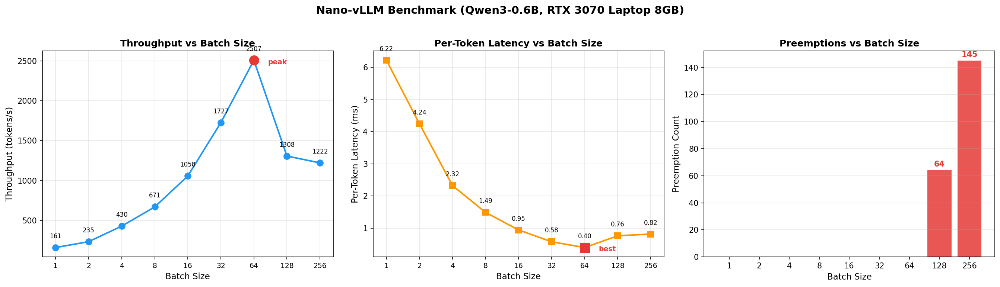

## 📝 Nano-vllm源码学习

本仓库 Fork 自 [GeeeekExplorer/nano-vllm](https://github.com/GeeeekExplorer/nano-vllm)，在原始代码基础上添加了：

- **中文注释**：`scheduler.py` / `block_manager.py` / `llm_engine.py` / `attention.py` 核心代码逐行中文注释
- **调度统计功能**：新增 Prefill / Decode / Preemption / Cache Hit 计数器
- **Benchmark 实验**：9 组不同 batch size 的吞吐量对比实验 + 可视化图表
- **学习笔记**：11 天的源码学习笔记（`docs/` 目录）

本项目是我 AI Infra 推理方向学习路线的一部分：

| 项目 | 内容 | 方向 |
|------|------|------|
| [CUDA-GEMM-Learning](https://github.com/YangMingjiu/CUDA-GEMM-Learning) | 6 种 GPU GEMM 优化技术 | GPU Kernel 优化 |
| [CUDA-FlashAttention-Learning](https://github.com/YangMingjiu/CUDA-FlashAttention-Learning) | FlashAttention Forward + Causal Mask | 算子优化 |
| **本项目** | 推理引擎源码学习 + Benchmark | 推理系统 |

### Benchmark 结果



**关键发现：**
- Batch 1→64：吞吐量从 161 提升到 2507 tok/s（**16× 提升**），Preemption = 0
- Batch 128+：显存不足触发频繁 Preemption（145 次），吞吐量下降到 1222 tok/s
- RTX 3070 Laptop 8GB 的最优并发数约为 64 个请求

详细学习笔记见 [`docs/`](docs/) 目录。

---
<p align="center">

</p>

<p align="center">
<a href="https://trendshift.io/repositories/15323" target="_blank"></a>
</p>

# Nano-vLLM

A lightweight vLLM implementation built from scratch.

## Key Features

* 🚀 **Fast offline inference** - Comparable inference speeds to vLLM
* 📖 **Readable codebase** - Clean implementation in ~ 1,200 lines of Python code
* ⚡ **Optimization Suite** - Prefix caching, Tensor Parallelism, Torch compilation, CUDA graph, etc.

## Installation

```bash
pip install git+https://github.com/GeeeekExplorer/nano-vllm.git
```

## Model Download

To download the model weights manually, use the following command:
```bash
huggingface-cli download --resume-download Qwen/Qwen3-0.6B \
  --local-dir ~/huggingface/Qwen3-0.6B/ \
  --local-dir-use-symlinks False
```

## Quick Start

See `example.py` for usage. The API mirrors vLLM's interface with minor differences in the `LLM.generate` method:
```python
from nanovllm import LLM, SamplingParams
llm = LLM("/YOUR/MODEL/PATH", enforce_eager=True, tensor_parallel_size=1)
sampling_params = SamplingParams(temperature=0.6, max_tokens=256)
prompts = ["Hello, Nano-vLLM."]
outputs = llm.generate(prompts, sampling_params)
outputs[0]["text"]
```

## Benchmark

See `bench.py` for benchmark.

**Test Configuration:**
- Hardware: RTX 4070 Laptop (8GB)
- Model: Qwen3-0.6B
- Total Requests: 256 sequences
- Input Length: Randomly sampled between 100–1024 tokens
- Output Length: Randomly sampled between 100–1024 tokens

**Performance Results:**
| Inference Engine | Output Tokens | Time (s) | Throughput (tokens/s) |
|----------------|-------------|----------|-----------------------|
| vLLM           | 133,966     | 98.37    | 1361.84               |
| Nano-vLLM      | 133,966     | 93.41    | 1434.13               |


## Star History

[](https://www.star-history.com/#GeeeekExplorer/nano-vllm&Date)